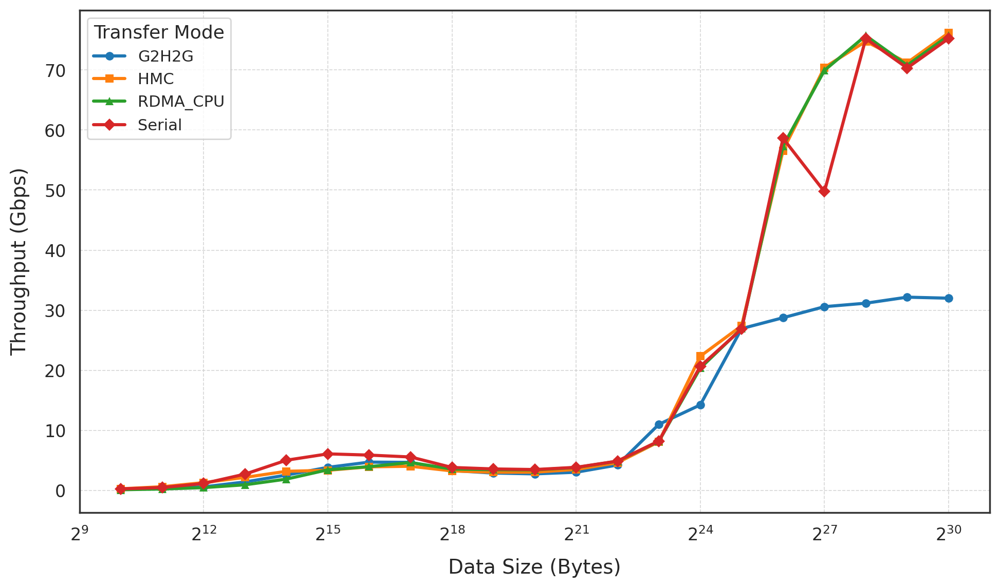

# HMC User Guide

**Heterogeneous Memories Communication Framework**
© 2025 SDU spgroup Holding Limited

---

## Overview

**HMC** is a **high-performance GPU communication framework** for heterogeneous computing.
It performs **GPU-direct data transfer** with **low QP and pinned memory usage**, sustaining **high throughput under limited RDMA resources**.

---

At a **4 MB buffer size**, HMC achieves **significantly higher bandwidth** than CPU-mediated transfers, demonstrating its efficiency in GPU-direct data paths.



---

### Features

* Unified memory abstraction for CPU and GPU
* Support for heterogeneous GPUs, including NVIDIA, AMD, Hygon, Cambricon, and Moore Threads
* GPU-direct RDMA communication without host staging
* Efficient copy–transfer overlap for improved pipeline utilization
* Superior bandwidth scalability with large transfer sizes

---

## ⚙️ Build & Installation

### Prerequisites

#### System Dependencies

* **C++14** compiler or higher
* **CMake ≥ 3.18**
* **Glog** (for logging)

  ```bash
  sudo apt-get install libgoogle-glog-dev
  ```
* **GTest** (optional, for testing)

  ```bash
  sudo apt-get install libgtest-dev
  ```
* Device-specific drivers and SDKs:

  * **CUDA** (for NVIDIA GPU)
  * **ROCm** (for AMD GPU)
  * **CNRT / MLU-OP** (for Cambricon MLU)
  * **Ascend CANN** (for Huawei Ascend NPU)
  * **MUSA Runtime** (for Moore Threads GPU)

---

### Build from Source

```bash
# Clone and enter the repository
git clone https://github.com/IIC-SIG-MLsys/HMC.git
cd HMC

# Create build directory
mkdir build && cd build

# Generate Makefile
cmake ..

# Compile
make -j
```

#### Optional CMake Flags

| Option                  | Description                          |
| ----------------------- | ------------------------------------ |
| `-DBUILD_STATIC_LIB=ON` | Build static library (`libhmc.a`)    |
| `-DBUILD_PYTHON_MOD=ON` | Build Python bindings (via PyBind11) |

---

### Python Package (Optional)

HMC provides a Python interface built with **PyBind11**.

```bash
# Initialize submodules
git submodule update --init --recursive

# Rebuild with Python module enabled
cmake .. -DBUILD_PYTHON_MOD=ON
make -j

# Build Python wheel
python -m build

# Install the package
pip install dist/hmc-*.whl
```

---

## 🚀 Quick Start

### Example 1 — Basic Memory Management

```cpp
#include <hmc.h>
using namespace hmc;

int main() {
    Memory gpu_mem(0, MemoryType::NVIDIA_GPU);
    void* gpu_ptr = nullptr;

    // Allocate 1MB on GPU
    gpu_mem.allocateBuffer(&gpu_ptr, 1024 * 1024);

    // Copy data from CPU to GPU
    std::vector<char> host_data(1024 * 1024, 'A');
    gpu_mem.copyHostToDevice(gpu_ptr, host_data.data(), host_data.size());

    // Free GPU memory
    gpu_mem.freeBuffer(gpu_ptr);
}
```

---

### Example 2 — RDMA Communication

```cpp
#include <hmc.h>
using namespace hmc;

// Shared RDMA buffer
auto buffer = std::make_shared<ConnBuffer>(0, 64 * 1024 * 1024);
Communicator comm(buffer);

std::string server_ip = "192.168.2.100";

// Client
comm.connectTo(server_ip, 2025, ConnType::RDMA);
comm.writeTo(server_ip, 0, 4096);
comm.disConnect(server_ip, ConnType::RDMA);

// Server
comm.initServer(server_ip, 2025, ConnType::RDMA);
comm.closeServer();
```

---

### Example 3 — Control Message Channel

```cpp
#include <hmc.h>
using namespace hmc;

CtrlSocketManager& ctrl = CtrlSocketManager::instance();

// Start server
ctrl.startServer("0.0.0.0", 5555);

// Client side
int sock_fd = ctrl.getCtrlSockFd("192.168.2.100", 5555);
ctrl.sendCtrlInt("192.168.2.100", 42);

// Receive control integer
int value;
ctrl.recvCtrlInt("192.168.2.100", value);
printf("Received control value: %d\n", value);

// Clean up
ctrl.closeConnection("192.168.2.100");
```

---

## 🧠 API Reference

### 1️⃣ Memory Management (`Memory`)

| Method                                                         | Description                            |
| -------------------------------------------------------------- | -------------------------------------- |
| `allocateBuffer(void** addr, size_t size)`                     | Allocate memory on the selected device |
| `freeBuffer(void* addr)`                                       | Free allocated memory                  |
| `copyHostToDevice(void* dest, const void* src, size_t size)`   | Copy data from host to device          |
| `copyDeviceToHost(void* dest, const void* src, size_t size)`   | Copy data from device to host          |
| `copyDeviceToDevice(void* dest, const void* src, size_t size)` | Copy within same device                |

Supported memory types:

```cpp
enum class MemoryType {
  DEFAULT,
  CPU,
  NVIDIA_GPU,
  AMD_GPU,
  CAMBRICON_MLU,
  HUAWEI_ASCEND_NPU,
  MOORE_GPU
};
```

---

### 2️⃣ Connection Buffer (`ConnBuffer`)

| Method                                              | Description                      |
| --------------------------------------------------- | -------------------------------- |
| `writeFromCpu(void* src, size_t size, size_t bias)` | Write CPU data to buffer         |
| `readToCpu(void* dest, size_t size, size_t bias)`   | Read buffer data to CPU          |
| `writeFromGpu(void* src, size_t size, size_t bias)` | Write GPU data into buffer       |
| `readToGpu(void* dest, size_t size, size_t bias)`   | Read buffer data into GPU memory |

---

### 3️⃣ Communicator

The unified RDMA/UCX communication manager.

| Method                                              | Description                |
| --------------------------------------------------- | -------------------------- |
| `initServer(ip, port, type)`                        | Initialize RDMA/UCX server |
| `connectTo(ip, port, type)`                         | Connect to remote endpoint |
| `writeTo(ip, offset, size, type)`                   | RDMA write data            |
| `readFrom(ip, offset, size, type)`                  | RDMA read data             |
| `sendDataTo(ip, buf, size, buf_type, type)`         | Send large data buffer     |
| `recvDataFrom(ip, buf, size, buf_type, flag, type)` | Receive large data buffer  |
| `closeServer()`                                     | Stop server                |
| `disConnect(ip, type)`                              | Disconnect from peer       |

---

### 4️⃣ Control Channel (`CtrlSocketManager`)

| Method                        | Description                     |
| ----------------------------- | ------------------------------- |
| `startServer(bind_ip, port)`  | Start TCP control server        |
| `getCtrlSockFd(ip, port)`     | Connect to control server       |
| `sendCtrlInt(ip, int value)`  | Send integer control message    |
| `recvCtrlInt(ip, int& value)` | Receive integer control message |
| `sendCtrlStruct(ip, obj)`     | Send POD structure              |
| `recvCtrlStruct(ip, obj)`     | Receive POD structure           |
| `closeConnection(ip)`         | Close connection                |
| `closeAll()`                  | Close all connections           |

---

### 5️⃣ Status Codes

| Enum             | Meaning             |
| ---------------- | ------------------- |
| `SUCCESS`        | Operation succeeded |
| `ERROR`          | General error       |
| `UNSUPPORT`      | Not supported       |
| `INVALID_CONFIG` | Configuration error |
| `TIMEOUT`        | Timeout occurred    |
| `NOT_FOUND`      | Object not found    |

---

## 🧪 Benchmark Example

```bash
# Run RDMA CPU benchmark
./build/apps/uhm_app/uhm_server --mode uhm
./build/apps/uhm_app/uhm_client --mode uhm
```

Supported modes:

| Mode       | Description              |
| ---------- | ------------------------ |
| `uhm`      | GPU direct RDMA          |
| `rdma_cpu` | CPU-only RDMA            |
| `g2h2g`    | GPU → Host → GPU         |
| `serial`   | Sequential CPU transfers |

---

## 📚 Summary

HMC provides a **unified, modular, and extensible** interface for developers working on heterogeneous systems.
It abstracts device memory operations, RDMA/UCX networking, and control synchronization under a single C++ API.

* Simple interface design for CPU/GPU/NPU memory
* Fast RDMA-based communication
* Compatible with major accelerator SDKs
* Optional Python bindings for high-level users

---

```
© 2025 SDU spgroup Holding Limited  
All rights reserved.
```